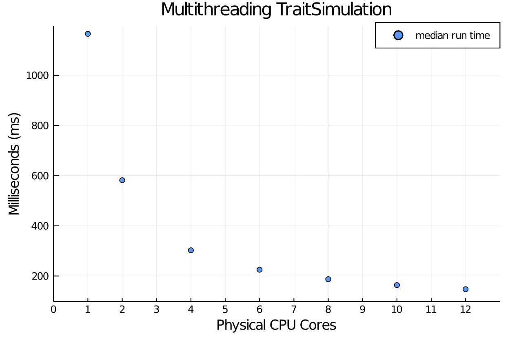

# TraitSimulation explores Threading in Julia: 

Threading:
For users who wish to do multiple simulation runs simultaneously, we recommend to set the machinery to use threading. Users can check using the command: `Threads.nthreads()` to ensure multi-threading is on. TraitSimulation will automatically use the Threading option for multiple TraitSimulation. To set the number of threads, users should follow the documentation on Threads.jl and ensure before starting Julia to specify the desired number of threads using the following command for 4 threads: 
    `export JULIA_NUM_THREADS=4.` 

In this notebook we want to demonstrate the threading capabilites provided by the Julia language, as it applies to TraitSimulation. Users who wish to simulate many traits simultaneously may find this useful. 

It is vital that users are aware of the settings on the machine used to thread the code. For instance, a 4 core machine will be able to specify up to 8 logical cores. But the true performance gain will be from increasing from within the range of the physical cores (1 - 4). We use the `BenchmarkTools.jl` package to demonstrate the performance gain as we increase the number of physical cores.


Generate test data:

We first construct the desired design matrix, regression coefficients, and variance components and covariance matrices for simulation. We will demonstrate the threading results on the following bivariate trait model with $m = 2$ variance components, two fixed effects for a sample size of $ n = 1000$ individuals. Each simulation run 1000 times.  

$\text{vec}(Y) \sim \text{Normal}(X B, \Sigma_1 \otimes V_1 + \cdots + \Sigma_m \otimes V_m)$


```julia
using Random, GLM, DataFrames, TraitSimulation
using LinearAlgebra, Distributions, CSV, Plots
using BenchmarkTools

Random.seed!(1234);

n = 1000   # no. observations
I_n = Matrix{Float64}(I, n, n );
d = 2      # dimension of responses
m = 2      # no. variance components
p = 2      # no. covariates

# n-by-p design matrix
X = randn(n, p)

# p-by-d mean component regression coefficient
B = ones(p, d)  

# a tuple of m covariance matrices
V = ntuple(x -> zeros(n, n), m) 

for i = 1:m-1
  V[i]  .= fill(0.1, n, n) .+ 1*Matrix{Float64}(I, n, n) # compound symmetry
end

copy!(V[m], Matrix{Float64}(I, n, n)) # last covarianec matrix is idendity
# a tuple of m d-by-d variance component parameters

Σ = ntuple(x -> zeros(d, d), m) 
for i in 1:m
    Σ[i]  .= fill(0.1, d, d) .+ 0.9.*Matrix{Float64}(I, d, d) # compound symmetry
end

variance_formula = @vc Σ[1] ⊗ V[1] + Σ[2] ⊗ V[2]
vcm_model1 = VCMTrait(X, B, variance_formula)
```


    Variance Component Model
      * number of traits: 2
      * number of variance components: 2
      * sample size: 1000


```julia
function simulate_old_no_threading(trait::Simulation.VCMTrait, n::Integer)
      # pre-allocate output
      Y_n = [zeros(size(trait.μ)) for _ in 1:n] # replicates
      # do the simulation n times, storing each result in a column
      for k in 1:n
          Simulation.simulate!(Y_n[k], trait)
      end
      return Y_n
  end

# this is a function with threading
function simulate_threads(trait::Simulation.VCMTrait, n::Integer)
    # pre-allocate output
    Y_n = [zeros(size(trait.μ)) for _ in 1:n] # replicates
    # do the simulation n times
    Threads.@threads for k in 1:n
        Simulation.simulate!(Y_n[k], trait)
    end
    return Y_n
end

```


    simulate_threads (generic function with 1 method)


```julia
@benchmark Y = simulate_threads(vcm_model1, 1000)
```


    BenchmarkTools.Trial: 
      memory estimate:  15.39 MiB
      allocs estimate:  1050
      --------------
      minimum time:     1.183 s (0.00% GC)
      median time:      1.353 s (0.00% GC)
      mean time:        1.480 s (0.07% GC)
      maximum time:     2.032 s (0.20% GC)
      --------------
      samples:          4
      evals/sample:     1


```julia
runtime_results = CSV.read("benchmarking_threading.csv")
```


## Benchmarking Results 


```julia
scatter(xlabel = "Physical CPU Cores", ylabel = "Milliseconds (ms)", markersize = 4, label = "median run time", title = "Multithreading TraitSimulation", runtime_results[1:12, 1] , runtime_results[1:12, 2], xlims = (0, 13), xticks = 0:1.0:12)
```



